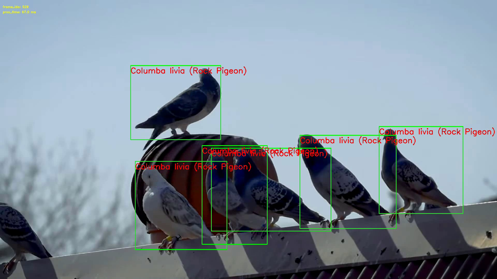
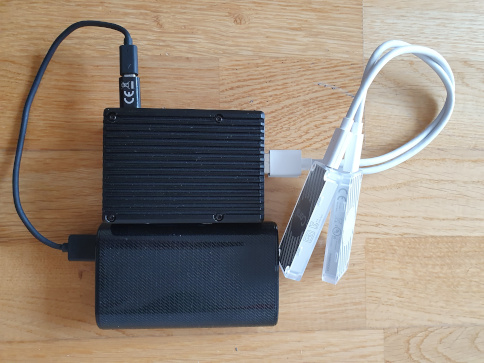

# DIY Pigeon Repellent with Artificial Intelligence

## Real-Time Pigeon Detection with Raspberry Pi 4 and Coral Edge TPU Acceleration

The purpose of this project is to build a low-cost, low-power consumption pigeon repellent.
The algorithm can run in real-time on a Raspberry Pi 4, performing inference on TPU edge devices.

*Source [video](https://www.youtube.com/watch?v=EE0QAaSgAHU) of processed frame.*

*Processing hardware setup; RPi4 with two Coral Edge USB TPU and external battery power supply*

## Detection and Classification Models

The algorithm first performs object detection to detect birds with an SSDLite MobileDet network, pretrained on the COCO dataset.
Pretrained EdgeTPU detection
[model](https://raw.githubusercontent.com/google-coral/test_data/master/ssdlite_mobiledet_coco_qat_postprocess_edgetpu.tflite)
and [labels](https://raw.githubusercontent.com/google-coral/test_data/master/coco_labels.txt).

For each detected bird, the algorithm performs a bird classification second step using a MobilenetV2 network, pretrained on the iNaturalist 2017 (birds) dataset.
Pretrained EdgeTPU classification
[model](https://raw.githubusercontent.com/google-coral/test_data/master/mobilenet_v2_1.0_224_inat_bird_quant_edgetpu.tflite)
and [labels](https://raw.githubusercontent.com/google-coral/test_data/master/inat_bird_labels.txt).

## Performance

The current implementation on the above-mentioned test video achieved a frame rate between ~12 and ~20 FPS.
The fluctuation of the performance is due to the varying number of classifications performed on the detected birds.
If needed, the frame rate could be either optimized by setting a maximum number of birds to be classified, or by adding more TPU for classification.

For better performance, two TPU devices are used where one performs detection, while the other performs classification.
Executing two different larger networks on one TPU requires swapping the model on the hardware, which results in performance loss.

The current processing pipeline is sequential, where each processing step has to wait for the previous one to finish.
In case of higher performance needs, enabling multi-threading would increase the utilization of the TPUs.
The API of the Coral TPU is expected to release the GIL, therefore multi-threading should be sufficient.
For more info, see [link](https://coral.ai/docs/edgetpu/multiple-edgetpu/#performance-considerations)

## Requirements

- Linux OS (optionally: Raspberry Pi 4)
- Coral Edge TPU Device (optionally: two devices)

## Installation

### Devcontainer using VSCode

 - Set up docker based on:
   - https://docs.docker.com/engine/install/raspberry-pi-os/ (32bit)
   - https://docs.docker.com/engine/install/debian/ (64bit)
   - https://docs.docker.com/engine/install/linux-postinstall/

- Issue with root "Failed to load delegate from libedgetpu.so.1":
   - https://github.com/tensorflow/tensorflow/issues/32743
   - https://github.com/google-coral/tflite/issues/3

- Run your devcontainer in VSCode

- Download pretrained models (see below)

### Linux Base System

- Clone this repository

    `git clone https://github.com/adamp87/pigeon-detection.git`;

- Go into the repository

    `cd pigeon-detection`;

- Install dependencies (optionally, set up virtual environment)
  - `conda create -n pigeon python=3.7` (optional),
  - `conda activate pigeon` (optional),
  - `pip install -r requirements.txt`,
  - Note: tested with PyCoral2,OpenCV4

- Set up Coral AI USB Accelerator according to [Coral AI instructions](https://coral.ai/docs/accelerator/get-started/)
  - If conda virtual environment was used, make sure to install PyCoral in the environment

- Download pretrained model linked in "Detection and Classification Models" section and put in pigeon/models folder
  - Or go to the model folder and execute the download.sh script

## Licensing

Source code is licensed under MIT license.

Pretrained models are downloaded from Coral AI, license information can be found on their [website](https://coral.ai/).
