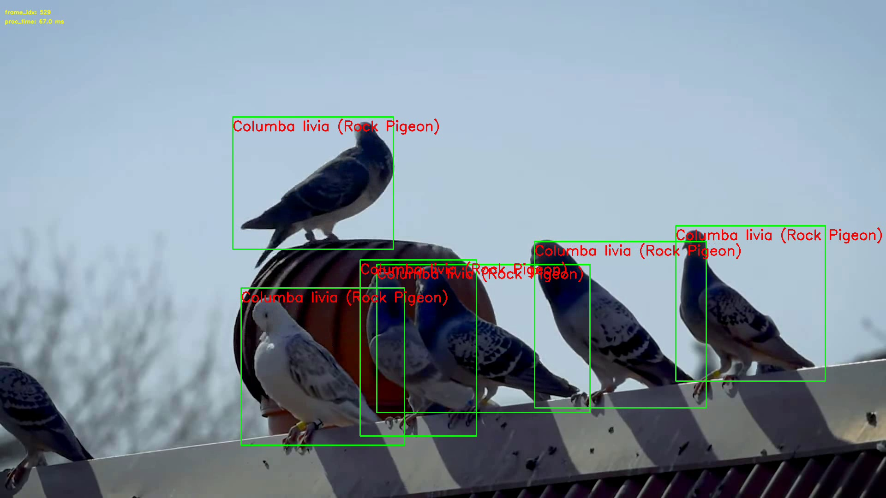
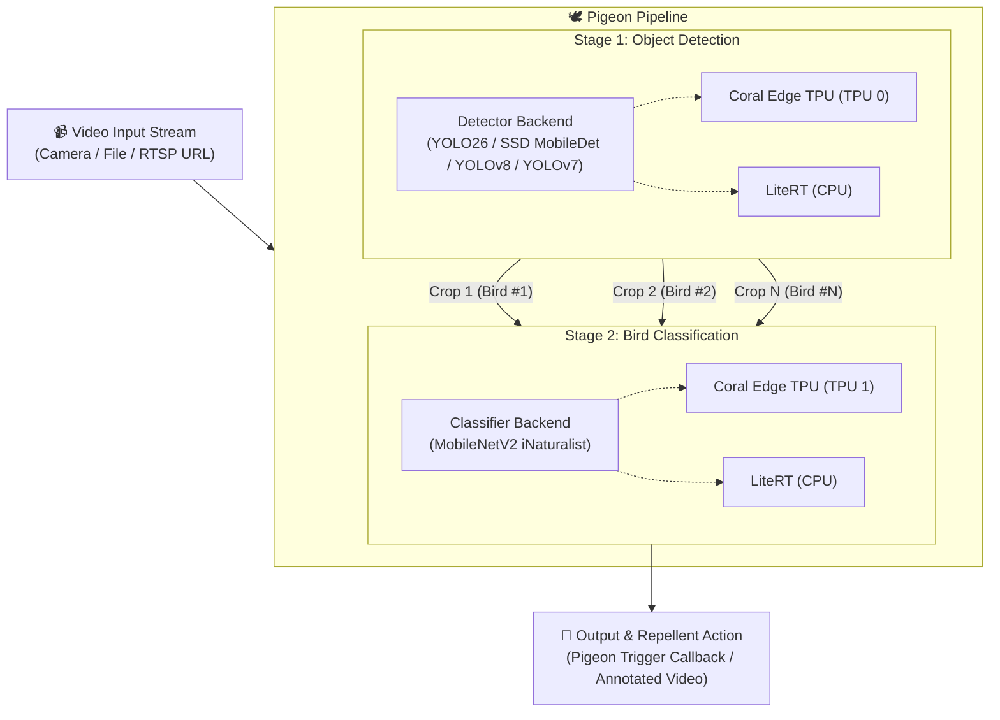

# Pigeon Repellent: Real-Time Edge Vision System

An automated edge-vision system designed to detect and repel pigeons in real time. It supports both **Raspberry Pi 5 with Dual Coral Edge TPUs** (using `pycoral` hardware delegates) and modern **Raspberry Pi 5 / PC** devices using Google's **LiteRT** runtime.

> **Terms of Use**: By accessing, viewing, reading, cloning, downloading, modifying, or using this repository (or any commit, branch, fork, or release), you explicitly agree to the [Disclaimer & Legal Notice](#-disclaimer--legal-notice) set forth at the end of this document.



---

## 🏗️ Architecture & Platform Support

The pipeline operates in two stages:
1. **Object Detection**: Detects generic birds in the frame (using YOLO26, SSD MobileDet, YOLOv8, or YOLOv7).
2. **Bird Classification**: Crops each detected bird and performs fine-grained classification (using MobileNetV2 pretrained on iNaturalist birds) to identify pigeons and doves.


```mermaid
flowchart TD
    InputStream["📹 Video Input Stream<br/>(Camera / File / RTSP URL)"] --> Pipeline

    subgraph Pipeline["🕊️ Pigeon Pipeline"]
        direction TB

        subgraph Stage1["Stage 1: Object Detection"]
            Detector["Detector Backend<br/>(YOLO26 / SSD MobileDet / YOLOv8 / YOLOv7)"]
            DetTPU["Coral Edge TPU (TPU 0)"]
            DetCPU["LiteRT (CPU)"]
            Detector -.-> DetTPU
            Detector -.-> DetCPU
        end

        subgraph Stage2["Stage 2: Bird Classification"]
            Classifier["Classifier Backend<br/>(MobileNetV2 iNaturalist)"]
            ClsTPU["Coral Edge TPU (TPU 1)"]
            ClsCPU["LiteRT (CPU)"]
            Classifier -.-> ClsTPU
            Classifier -.-> ClsCPU
        end

        Stage1 -->|"Crop 1 (Bird #1)"| Stage2
        Stage1 -->|"Crop 2 (Bird #2)"| Stage2
        Stage1 -->|"Crop N (Bird #N)"| Stage2
    end

    Stage2 --> Output["🎯 Output & Repellent Action<br/>(Pigeon Trigger Callback / Annotated Video)"]
```

### ⚠️ Note on PyCoral & Coral Edge TPU Maintenance
> **Important**: Google is no longer actively maintaining `pycoral`. The official `pycoral` wheels only support up to **Python 3.9** and require **NumPy < 2.0**.
>
> - **For Raspberry Pi 5 / Modern PCs (CPU/GPU)**: We recommend running the **LiteRT (`ai-edge-litert`)** backend natively on **Python 3.12** (Debian Bookworm) with modern models like **YOLO26**.
> - **For Raspberry Pi 5 with Coral Edge TPUs**: We provide a dedicated **Python 3.9** container with PyCoral pre-installed, NumPy pinned to `<2.0`, and full support for single and **dual Edge TPU accelerators**.

---

## 📦 Installation & Packaging with `uv`

We use standard Python packaging (`pyproject.toml`) and [`uv`](https://github.com/astral-sh/uv) for fast, reproducible dependency management.

### 1. Modern CPU / LiteRT (RPi5, PCs, Python 3.12+)
```bash
# Clone the repository
git clone https://github.com/adamp87/pigeon.git
cd pigeon

# Install with uv (or pip)
uv pip install -e ".[tflite]"
```

### 2. Coral Edge TPU (RPi5 with Coral USB, Python 3.9)
```bash
# Install Coral extra (pins numpy < 2.0 for PyCoral C-ABI compatibility)
uv pip install -e ".[coral]"
```

---

## 🐳 Docker & DevContainer Setup

We provide a flexible Docker Compose configuration with two distinct environments:
- `docker/Dockerfile.tflite`: Python 3.12 Bookworm + LiteRT (for RPi5 / CPU development)
- `docker/Dockerfile.coral`: Python 3.9 Bookworm + PyCoral + libedgetpu (for RPi5 with Dual USB Coral TPUs)


### Running with Docker Compose

You can select your target environment in `docker-compose.user.yml`:

```bash
# 1. Copy the user override template (if not already created)
cp docker-compose.user.yml.example docker-compose.user.yml

# 2. Select Option 1 (LiteRT) or Option 2 (Coral) inside docker-compose.user.yml

# 3. Build and run the app service
docker compose up -d app
docker compose exec app bash
```

### Custom Device Passthrough (`docker-compose.user.yml`)
To map local cameras (e.g. `/dev/video0`) or custom host paths, uncomment device mappings in `docker-compose.user.yml`:
```yaml
services:
  app:
    devices:
      - /dev/video0:/dev/video0
```

### VS Code DevContainer
Open the project in VS Code and select **Reopen in Container**. The active environment is determined by your selection in `docker-compose.user.yml`.


---

## 📥 Download Pretrained Models & Test Data

Run the download scripts to retrieve the models and test images:
```bash
# Download pretrained models into data/models/
bash data/models/download.sh

# Download test images into data/testdata/pigeons/
bash data/testdata/download.sh
```

This will download:
- `yolo26n-det-int8.tflite` (LiteRT / CPU detector)
- `ssdlite_mobiledet_coco_qat_postprocess_edgetpu.tflite` (Coral detector)
- `mobilenet_v2_1.0_224_inat_bird_quant_edgetpu.tflite` (Bird classifier)
- COCO and iNaturalist label files
- Sample test images for E2E validation

---

## 🚀 Usage & CLI

After installation, run `pigeon` directly from the terminal:

```bash
# Run on RPi5 / PC using LiteRT and YOLO26
pigeon -i input.mp4 -o output.mp4 --detector yolo26 --backend tflite

# Run on RPi4 with Coral Edge TPU
pigeon -i input.mp4 -o output.mp4 --detector ssd --backend edgetpu

# Run on live USB camera (device /dev/video0)
pigeon -i 0 --detector yolo26
```

### CLI Arguments
- `-i`, `--input`: Input video path, directory of images, camera index (e.g. `0`), or RTSP stream URL.
- `-o`, `--output`: Optional output video path with annotations.
- `-b`, `--backend`: `auto`, `tflite`, or `edgetpu`.
- `-d`, `--detector`: `yolo26`, `ssd`, `yolov8`, or `yolov7`.
- `-t`, `--threshold`: Detection confidence score threshold (default: `0.5`).
- `-k`, `--top_k`: Number of top classification candidates to check (default: `2`).
- `--fps`: Output video FPS (default: `1.0` for image directories, source fps for video).
- `--loop`: Loops input video or image sequence.
- `--benchmark`: Prints structured latency benchmark metrics upon completion.
- `-v`, `--verbose`: `0` (warnings only), `1` (info), `2` (debug).

---

## 🖼️ Input Image Preprocessing, Resizing & Letterboxing

When feeding high-resolution video streams (e.g., 1080p or 4K widescreen) into neural network detectors with fixed square input shapes (such as 640×640 or 320×320):

1. **Aspect Ratio Preservation**:
   - Direct non-uniform stretching or squashing alters the geometric aspect ratio and spatial features of targets (e.g. distorting bird proportions), which can degrade detection confidence and bounding box precision.
   - Preserving the original aspect ratio via uniform rescaling and neutral padding (letterboxing) maintains spatial fidelity across all camera angles and aspect ratios.

2. **Preprocessing Across Detectors & Classifiers**:
   - **`YOLO26`**: Implements **letterbox preprocessing** with uniform aspect ratio scaling, padding, and inverse coordinate un-letterboxing to accurately map bounding boxes back to original frame dimensions.
   - **`YOLOv7` & `YOLOv8`**: Currently use direct resizing; they should also be upgraded to use letterbox preprocessing to preserve aspect ratio on widescreen inputs.
   - **`SSD MobileDet` / `SSDLite` (320×320)**: Uses **direct resize**. This matches the original TensorFlow Object Detection API training distribution (random crop + direct resize) and avoids wasting up to 44% of the small 320×320 pixel budget on letterbox padding borders.
   - **`MobileNetV2 Bird Classifier` (224×224)**: Uses **direct resize on tight crops**. Once a bird is detected, the bounding box crop is directly resized to 224×224. This aligns with standard ImageNet / iNaturalist classification training (random resized crops without artificial border padding) and fills the network's receptive field completely with bird features.

---

## ⚡ Performance & Benchmarks

Stage-by-stage pipeline latency breakdown measured on Raspberry Pi 5 across backends (normalized warm cache):

| Pipeline Stage | LiteRT (CPU / Container) | Single Coral TPU (`:0` Det + CPU Cls) | Dual Coral Edge TPU (`:0` Det + `:1` Cls) | Description |
|---|:---:|:---:|:---:|---|
| **1. Frame Read & Decode** | `271.25 ms` | `272.23 ms` | `264.22 ms` | High-res JPEG decode & loading from disk |
| **2. Preprocessing** | `4.18 ms` | `4.17 ms` | `3.49 ms` | Color conversion & resizing |
| **3. Bird Detection (SSD MobileDet)** | `85.46 ms` | `18.84 ms` (TPU 0) | **`18.19 ms` (TPU 0)** | Object detection & bbox decoding |
| **4. Pigeon Classification (MobileNetV2)** | `28.82 ms` | `19.81 ms` (CPU) | **`8.16 ms` (TPU 1)** | Bird crop & fine-grained classification |
| **5. Overlay & Drawing** | `0.94 ms` | `0.89 ms` | `1.08 ms` | Bounding boxes & debug labels |
| **Pure Inference Latency (Det + Cls)** | **`114.28 ms`** | **`38.64 ms`** | **`26.35 ms`** | Pure neural network compute time |
| **Pure Inference Throughput** | **`8.75 FPS`** | **`25.88 FPS`** | **`37.95 FPS`** | Maximum inference engine capability |
| **Live Stream / Camera Processing** | **`8.38 FPS`** | **`22.88 FPS`** | **`32.34 FPS`** | Real-time camera throughput (excl. disk I/O) |

---

## 🔌 Cline & VS Code Terminal Configuration

To ensure seamless execution across both AI coding agents (Cline) and interactive VS Code terminals:

1. **Virtual Environment in PATH**:
   The Docker container installs the virtualenv at `/home/user/.venv` and places `/home/user/.venv/bin` first in `$PATH` (`ENV PATH="/home/user/.venv/bin:$PATH"`).
2. **Avoiding Shell Integration Desync**:
   Because Debian containers use `dash` as `/bin/sh` (which lacks the bash `source` command), VS Code's `"python.terminal.activateEnvironment": false` is configured in `.devcontainer/devcontainer.json`. This avoids `/bin/sh: 1: source: not found` errors while ensuring all tools (`python`, `pytest`, `ruff`, `mypy`) execute from the virtualenv directly.

---

## ⚡ Dual Coral Edge TPU Setup & USB Device Permissions

When using Google Coral USB Accelerators on Linux (especially Raspberry Pi 5 with Linux 6.x kernel):

1. **USB Re-enumeration**:
   Coral USB sticks connect initially in DFU bootloader mode (`Vendor ID 1a6e:089a`). When `libedgetpu` loads the TPU firmware, the device resets and re-enumerates as an active Edge TPU (`Vendor ID 18d1:9302`).
2. **Device Passthrough & Permissions**:
   - `docker-compose.user.yml` maps `devices: - /dev/bus/usb:/dev/bus/usb` with `privileged: true`.
   - `.devcontainer/devcontainer.json` runs a dedicated post-attach script (`.devcontainer/post-attach.sh`) that sets `plugdev` group ownership and `0777` permissions on `/dev/bus/usb`, granting runtime read/write access for the non-root container user across USB re-enumeration.

3. **Multi-TPU Pipeline Addressing**:
   The CLI automatically routes the detector model to TPU 0 (`--tpu-0 :0`) and the fine-grained classifier to TPU 1 (`--tpu-1 :1`).

---

## 🛠️ Code Quality & Pre-Commit

We enforce linting, formatting, and static typing targeting Python 3.12 (with runtime compatibility down to Python 3.9 via `from __future__ import annotations`):

```bash
# Run Ruff linter
ruff check --fix

# Run Ruff formatter
ruff format

# Run MyPy type checker
mypy src tests

# Run all pre-commit hooks
pre-commit run --all-files
```

---

## 🧪 Running Tests

Run unit, benchmark, and end-to-end integration tests with `pytest`:
```bash
pytest
```

---

## 📄 Licensing

Source code is licensed under the MIT License. Pretrained models and datasets are subject to their respective original licenses.

---

## ⚖️ Disclaimer & Legal Notice


### AI-Generated Content Notice
This repository contains code, documentation, configuration files, scripts, and architectural designs that may have been generated, edited, or assisted by Artificial Intelligence (AI) technologies. While reasonable efforts have been made to verify correctness, AI-assisted content may contain unforeseen errors, inaccuracies, omissions, or edge-case bugs.

### "As-Is" Software & Hardware Deployment
THE SOFTWARE, DOCUMENTATION, PRETRAINED MODELS, CONFIGURATIONS, AND ALL ASSOCIATED MATERIALS ARE PROVIDED **"AS IS" AND "AS AVAILABLE"**, WITHOUT WARRANTY OF ANY KIND, EITHER EXPRESS OR IMPLIED, INCLUDING BUT NOT LIMITED TO THE IMPLIED WARRANTIES OF MERCHANTABILITY, FITNESS FOR A PARTICULAR PURPOSE, TITLE, OR NON-INFRINGEMENT.

### Limitation of Liability & No Legal Claim
UNDER NO CIRCUMSTANCES SHALL THE AUTHORS, MAINTAINERS, CONTRIBUTORS, OR COPYRIGHT HOLDERS BE HELD LIABLE FOR ANY DIRECT, INDIRECT, INCIDENTAL, SPECIAL, EXEMPLARY, CONSEQUENTIAL, OR PUNITIVE DAMAGES, NOR ANY LOSS OR DAMAGE WHATSOEVER (INCLUDING, WITHOUT LIMITATION, DAMAGE TO PHYSICAL HARDWARE, CAMERAS, SENSORS, PERIPHERALS, LOSS OF DATA, CORRUPTION OF DATA, SYSTEM FAILURE, BUSINESS INTERRUPTION, LOSS OF PROFITS, OR PERSONAL INJURY) ARISING OUT OF OR IN CONNECTION WITH THE ACCESS, VIEWING, READING, CLONING, DOWNLOADING, USE, OR INABILITY TO USE THIS REPOSITORY OR ANY COMMITS HEREIN. NO LEGAL CLAIMS, ACTIONS, DEMANDS, OR LAWSUITS MAY BE BROUGHT AGAINST THE CONTRIBUTORS OR AUTHORS. USERS ASSUME COMPLETE RESPONSIBILITY AND RISK FOR ALL DEPLOYMENTS AND INTEGRATIONS.
